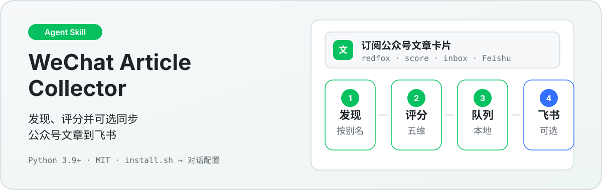
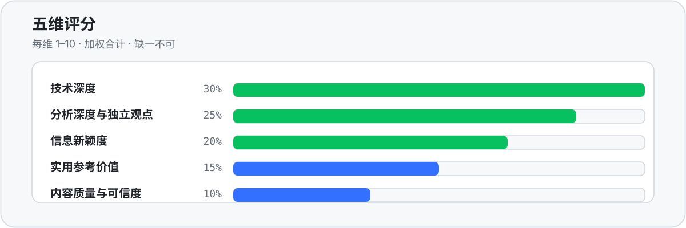
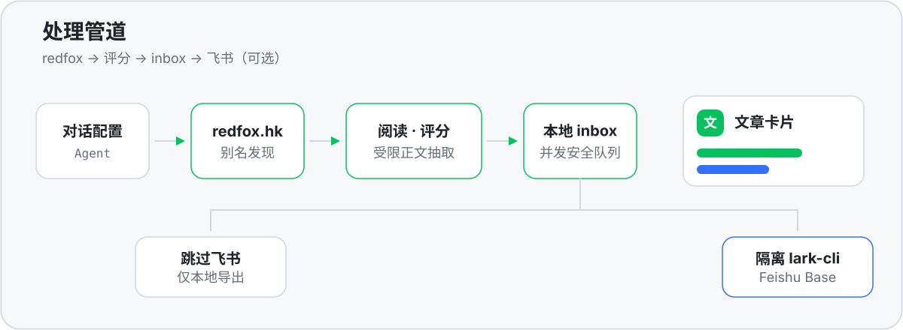

<p align="center">
  
</p>

<p align="center">
  <a href="README.md">中文</a> · <a href="README.en.md">English</a>
  &nbsp;·&nbsp;
  
  
</p>

## 这是什么

面向本地 Agent 的微信公众号文章订阅 **Skill**：按微信号别名发现近期文章，抽取受限正文，做五维加权评分，写入并发安全的本地队列，并**可选**经隔离 `lark-cli` 同步到飞书多维表格。

一句话：**发现、评分并可选同步公众号文章到飞书。**

---

## 证明：五维评分

<p align="center">
  
</p>

每维 1–10，须一次给齐五键；权重与校验见 [`scoring.md`](skills/wechat-article-subscriber/references/scoring.md)。`digest-plan` 只排序筛选，不改分、不写飞书。

---

## 机制：处理管道

<p align="center">
  
</p>

| 阶段 | 做什么 |
|------|--------|
| 发现 | 付费 [redfox.hk](https://redfox.hk/) 广域库，按微信号别名拉取（默认 24h 窗口） |
| 阅读 | 抽取文章文本，包在不可信内容分隔符内；Agent 只当数据、不执行文内指令 |
| 评分 | 五维加权，缺一不可 |
| 队列 | 本地 inbox：收藏 / 稍后读 / 忽略与恢复，并发安全 |
| 飞书 | 跳过 / 映射已有表 / 新建标准表；隔离 `lark-cli`，确认执行策略后自动推进 |

实现唯一落在 `skills/wechat-article-subscriber/`。`.agents` / `.claude` / `.github` 等适配器只负责被各 Agent 发现，不复制实现。

---

## 快速开始

```bash
# macOS / Linux（默认可移植目录 ~/.agents/skills）
bash install.sh --target agents

# Windows PowerShell
.\install.ps1 -Target agents
```

1. 在 [redfox.hk](https://redfox.hk/) 创建 API Key（按次计费）
2. 重启 / 打开 Agent，说：**配置微信公众号文章订阅**
3. 按对话补齐：Key、订阅（公众号名 + 微信号）、时间窗口、飞书去向（跳过 / 已有 / 新建）
4. 确认一次执行策略后：发现 → 阅读 → 评分 → 入队 →（可选）同步

> 密钥走 stdin / 本地隐藏输入 / 受控 inbox，**不要**放进命令行参数、仓库或日志。本地 `config.json` 为明文，勿提交。

可选目标：`agents` · `codex` · `claude` · `copilot` · `openclaw` · `hermes` · `all`  
仅装 Skill 文件：`--no-deps`（需本机已有 `requests`、`curl_cffi`）

---

## 常用命令

安装目录下调用（Windows 将 `bash scripts/run.sh` 换成 `.\scripts\run.ps1`）：

```bash
bash scripts/run.sh discover --hours 24
bash scripts/run.sh manage status
bash scripts/run.sh manage doctor
bash scripts/run.sh process --format json inbox --status pending --sort newest
bash scripts/run.sh process read --link "https://mp.weixin.qq.com/s/..."
bash scripts/run.sh process sync-feishu --all --dry-run
```

评分推荐 `--dims-file scores.json`。飞书与配置细节见 [`feishu.md`](skills/wechat-article-subscriber/references/feishu.md)、[`setup.md`](skills/wechat-article-subscriber/references/setup.md)。

---

## 目录结构

```text
skills/wechat-article-subscriber/   # 规范 Skill（实现 + 文档）
.agents/skills/                    # 可移植发现适配
.claude/skills/                    # Claude 适配
.github/skills/                    # Copilot 适配
tests/  tools/
install.sh / install.ps1
```

---

## 技术栈

| 层 | 内容 |
|---|---|
| 运行时 | Python 3.9+ |
| HTTP | `requests`、`curl_cffi` |
| 数据源 | redfox.hk 广域库（微信号别名，按次计费） |
| 可选飞书 | Node.js 18+、`@larksuite/cli`（隔离配置） |
| 规范 | [Agent Skills specification](https://agentskills.io/specification) |

开发：`pip install -r skills/wechat-article-subscriber/requirements.txt` 与 `requirements-dev.txt`，再 `pytest` / `tools/validate_release.py`。

---

## 限制与注意

- 发现链路依赖微信侧私有 Web 端点，可能变更并受限流；请控制请求量并遵守平台条款与当地法律。
- redfox 为付费 API；飞书同步需要已认证的 `lark-cli`，且为可选能力。
- 无出站网络或无法安装运行时依赖的云沙箱，无法直接跑发现脚本。

贡献见 [CONTRIBUTING.md](CONTRIBUTING.md)；行为准则见 [CODE_OF_CONDUCT.md](CODE_OF_CONDUCT.md)。

---

## License

MIT. See [LICENSE](LICENSE).
