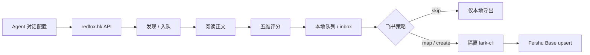

<!-- BEAUTIFIED -->
<!-- AUTO-GENERATED: hero + structure via general-readme-skill; facts from repo scan 2026-09-02 -->

<h1 align="center">WeChat Article Collector</h1>

<p align="center">
  <strong>微信公众号文章订阅 Agent Skill</strong>
  <br />
  <em>发现 · 阅读 · 五维评分 · 本地队列 · 可选同步飞书多维表格</em>
</p>

<p align="center">
  <a href="#-快速开始"></a>
  <a href="LICENSE"></a>
  <a href="#-兼容环境"></a>
</p>

<p align="center">
  
  
  
  
  
</p>

<p align="center">
  <a href="README.md">中文</a> · <a href="README.en.md">English</a>
</p>

---

## ✨ 能做什么

- **按订阅发现文章** — 通过付费 [redfox.hk](https://redfox.hk/) 广域库按微信号别名拉取近期公众号文章（默认 24h 窗口）
- **受限正文抽取** — 读取文章文本并包在不可信内容分隔符内，Agent 只当数据、不执行文内指令
- **五维评分** — 技术深度 / 信息新颖度 / 分析深度 / 实用价值 / 可信度（加权校验，缺一不可）
- **并发安全本地队列** — inbox 收藏、稍后读、忽略与恢复；`digest-plan` 只做排序筛选，不改分、不写飞书
- **可选飞书 Base 同步** — 跳过 / 映射已有表 / 创建标准表；经隔离 `lark-cli` 与执行策略一次确认后自动推进
- **多 Agent 一键安装** — `install.sh` / `install.ps1` 支持 agents、codex、claude、copilot、openclaw、hermes

---

## 🚀 快速开始

```bash
# macOS / Linux（默认可移植目录 ~/.agents/skills）
bash install.sh --target agents

# Windows PowerShell
.\install.ps1 -Target agents
```

1. 在 [redfox.hk](https://redfox.hk/) 创建 API Key（按次计费）
2. 重启 / 打开 Agent，说：**配置微信公众号文章订阅**
3. 按对话补齐：Key、订阅（公众号名 + 微信号）、时间窗口、飞书去向（跳过 / 已有 / 新建）
4. 确认一次执行策略后，发现 → 阅读 → 评分 → 入队 →（可选）同步自动推进

> 密钥走 stdin / 本地隐藏输入 / 受控 inbox，**不要**放进命令行参数、仓库文件或日志。本地 `config.json` 为明文，受当前系统账户权限保护，勿提交。

可选目标：`agents` · `codex` · `claude` · `copilot` · `openclaw` · `hermes` · `all`  
仅装 Skill 文件：`--no-deps`（需本机已有 `requests`、`beautifulsoup4`、`curl_cffi`）

---

## 🧩 用法一览

安装目录下通过包装脚本调用（Windows 将 `bash scripts/run.sh` 换成 `.\scripts\run.ps1`）：

```bash
bash scripts/run.sh discover --hours 24
bash scripts/run.sh manage status
bash scripts/run.sh manage doctor
bash scripts/run.sh process --format json inbox --status pending --sort newest
bash scripts/run.sh process read --link "https://mp.weixin.qq.com/s/..."
bash scripts/run.sh process sync-feishu --all --dry-run
```

评分用五键 JSON（见 [scoring.md](skills/wechat-article-subscriber/references/scoring.md)），推荐 `--dims-file scores.json`，避免各 Shell 引号差异。

更完整的飞书身份、授权、建表与字段映射见 [feishu.md](skills/wechat-article-subscriber/references/feishu.md) 与 [setup.md](skills/wechat-article-subscriber/references/setup.md)。

---

## 🏗 架构



实现唯一落在 `skills/wechat-article-subscriber/scripts/`。`.agents` / `.claude` / `.github` 下的适配器只负责被各 Agent 发现，不复制实现。

---

## 📁 目录结构

```text
skills/wechat-article-subscriber/   # 可安装的规范 Skill（实现 + 文档）
.agents/skills/                    # 可移植项目发现适配
.claude/skills/                    # Claude 适配
.github/skills/                    # Copilot 适配
tests/                             # 仓库测试
tools/                             # 发布校验与打包
install.sh / install.ps1           # 多 Agent 安装器
```

---

## 🛠 技术栈

| 层 | 内容 |
|---|---|
| 运行时 | Python 3.9+ |
| HTTP | `requests`、`curl_cffi`（`--no-deps` 时另需 `beautifulsoup4`） |
| 数据源 | redfox.hk 广域库（微信号别名查询，按次计费） |
| 可选飞书 | Node.js 18+、`@larksuite/cli`（隔离配置，不改用户全局 profile） |
| 规范 | [Agent Skills specification](https://agentskills.io/specification) |
| CI | GitHub Actions（`test.yml` / `release.yml`） |

---

## 💻 开发

```bash
python3 -m pip install -r skills/wechat-article-subscriber/requirements.txt
python3 -m pip install -r requirements-dev.txt
python3 -m compileall -q skills/wechat-article-subscriber/scripts tests tools
python3 -m pytest -q
python3 tools/validate_release.py
```

Windows 可用 `python` 或 `py -3`。

发现链路依赖微信侧私有 Web 端点，可能变更并受限流；请控制请求量并遵守平台条款与当地法律。

---

## 🤝 贡献

见 [CONTRIBUTING.md](CONTRIBUTING.md)。一般流程：fork → 分支 → 提交 → PR。行为准则见 [CODE_OF_CONDUCT.md](CODE_OF_CONDUCT.md)。

---

## 📄 License

MIT. See [LICENSE](LICENSE).
